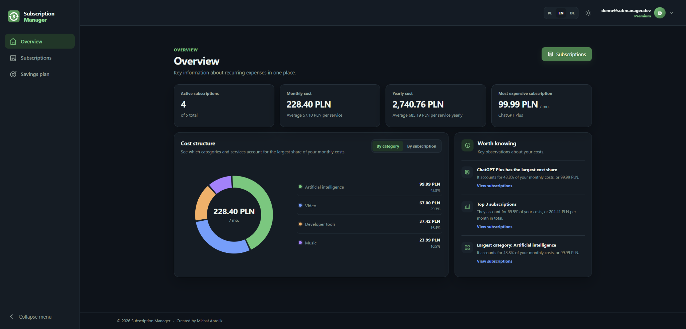

# Subscription Manager

[](https://github.com/michalantolik/subscription-manager/actions/workflows/ci.yml)
[](https://github.com/michalantolik/subscription-manager/actions/workflows/deploy.yml)
[](https://github.com/michalantolik/subscription-manager/actions/workflows/infrastructure.yml)

A web application for managing recurring subscriptions and tracking their costs.

**Live application:** [submanager.dev](https://submanager.dev)

## Features

- Create, edit and delete subscriptions
- Manage predefined and custom digital services
- Track recurring monthly and yearly costs
- Generate personalized savings plans
- Choose between Free, Plus and Premium plans
- Available in Polish, English and German

## Screenshot

[](docs/images/dashboard.png)

## Technologies

```text
.NET 10
│
├── Web ─────────────► Blazor Server
├── API ─────────────► ASP.NET Core Web API
├── Persistence ─────► Entity Framework Core ──► SQL Server
├── Infrastructure ──► Terraform ──► Azure
└── Tests ───────────► xUnit
```

## Architecture

```text
Web ──HTTP──► API
                │
                ├──► Application ──► Domain
                │
                └──► Infrastructure ──► Application + Domain
```

## External integrations

| Service                                   | Purpose                                         |
|-------------------------------------------|-------------------------------------------------|
| [Stripe API](https://docs.stripe.com/api) | Subscription billing and payment processing     |
| [NBP API](https://api.nbp.pl/)            | Exchange rates for subscription cost conversion |
| [OpenAI API](https://openai.com/api/)     | Personalized savings plan generation            |

## Project structure

| [Domain](src/SubscriptionManager.Domain/README.md) | [Application](src/SubscriptionManager.Application/README.md) | [Infrastructure](src/SubscriptionManager.Infrastructure/README.md) | [API](src/SubscriptionManager.Api/README.md) | [Web](src/SubscriptionManager.Web/README.md) |
|----------------------------------------------------|----------------------------------------------------------------|-------------------------------------------------------------------|------------------------------------------|------------------------------------------|
| `Billing`                                          | `Billing`                                                      | `Billing`                                                         | `Billing`                                | `Billing`                                |
| `DigitalServices`                                  | `DigitalServices`                                              | `DigitalServices`                                                 | `DigitalServices`                        | `DigitalServices`                        |
| `SavingsPlans`                                     | `SavingsPlans`                                                 | `SavingsPlans`                                                    | `SavingsPlans`                           | `SavingsPlans`                           |
| `Subscriptions`                                    | `Subscriptions`                                                | `Subscriptions`                                                   | `Subscriptions`                          | `Subscriptions`                          |
|                                                    | `Account`                                                      |                                                                   | `Account`                                | `Account`                                |
|                                                    | `Authentication`                                               | `Authentication`                                                  | `Authentication`                         | `Authentication`                         |
| `ExchangeRates`                                    | `ExchangeRates`                                                | `ExchangeRates`                                                   |                                          |                                          |
|                                                    |                                                                |                                                                   |                                          | `Overview`                               |
